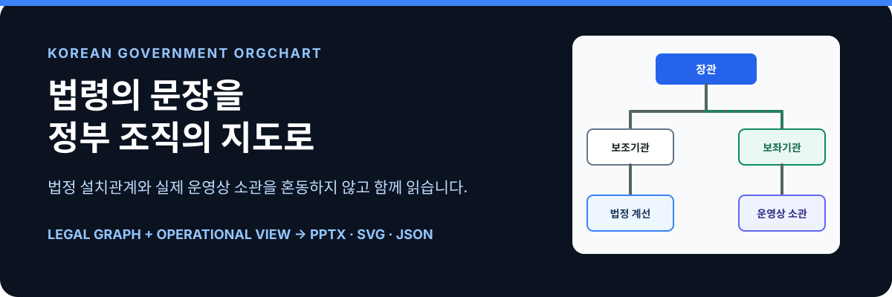

<p align="center">
  
</p>

<p align="center">
  <a href="https://hosungseo.github.io/korean-government-orgchart/"><strong>라이브 데모</strong></a>
  &nbsp;·&nbsp;
  <a href="#빠른-시작"><strong>빠른 시작</strong></a>
  &nbsp;·&nbsp;
  <a href="#무엇을-다르게-읽나"><strong>모델 보기</strong></a>
</p>

> **법령에 적힌 조직 설치 문언을 읽어, 편집 가능한 기구도(PPTX)·검토용 SVG·분석용 JSON으로 만듭니다.**
>
> 조직도는 직함의 목록이 아니라, 행정의 의사결정이 어디서 보좌되고 어떤 계선을 통해 집행되는지를 읽는 지도입니다.

## 이 도구가 만드는 것

| 입력 | 해석 | 결과 |
| --- | --- | --- |
| 직제·시행규칙 원문 또는 법제처 기준일 연혁 | 설치 문형, 기관 유형, 소관관계, 보직·한시 표식 | **PPTX**(편집) · **SVG**(검토·웹) · **HTML**(한글/HWPX 붙여넣기) · **JSON**(재사용) |

```text
“장관 소속으로 A를 둔다”        → 소속기관
“X에 A·B를 둔다”               → 보조기관(법정 계선)
“D는 Y를 보좌한다”              → 보좌기관(참모)
“정책관·교섭관 내 다른 과의 주관·소관” → 운영상 소관(별도 투영)
```

<p align="center">
  <a href="outputs/행정안전부-20251125.svg">행정안전부 예시</a>
  &nbsp;·&nbsp;
  <a href="outputs/산업통상부-20260724-운영형.svg">산업통상부 운영형 예시</a>
  &nbsp;·&nbsp;
  <a href="outputs/행정안전부-20251125-소관법령.svg">소관법령 결합 예시</a>
</p>

## 무엇을 다르게 읽나

법령의 조직 설치관계와 실제 업무의 소관관계를 하나의 선으로 섞으면, “누가 법적으로 설치됐는가”와 “누가 실무를 맡는가”를 동시에 잃게 됩니다. 이 프로젝트는 두 층을 분리해 보존합니다.

| 보기 | 보여주는 것 | 표현 |
| --- | --- | --- |
| `legal` | 법령상 설치관계 | 보조기관 실선, 보좌기관 점선, 소속기관 별도 계통 |
| `operational` | 출처가 확인된 정책관·국의 업무 소관 | 법정 그래프는 유지하고, 운영상 묶음만 점선으로 덧그림 |

원래 법정 그래프와 검증 메타데이터는 JSON에 그대로 남습니다. 따라서 발표용 그림을 만들면서 근거관계가 사라지지 않습니다.

## 빠른 시작

```bash
git clone https://github.com/hosungseo/korean-government-orgchart.git
cd korean-government-orgchart
npm ci
npm test
npm run demo
```

샘플은 `examples/sample-law.txt`를 읽어 아래 파일을 만듭니다.

```text
outputs/sample-orgchart.pptx  # 편집 가능한 PowerPoint
outputs/sample-orgchart.svg   # 검토·웹 삽입용 SVG
outputs/sample-orgchart.html  # 한글/HWPX 붙여넣기·인쇄용 검토시트
outputs/sample-orgchart.json  # 노드·관계·법적 메타데이터
```

### 기준일의 법령에서 만들기

```bash
node src/cli.mjs from-law \
  --institution "행정안전부" \
  --date 2025-11-25 \
  --layout best \
  --source-dir work/legal-snapshots/mois \
  --out outputs/행정안전부.pptx \
  --svg outputs/행정안전부.svg \
  --html outputs/행정안전부-검토시트.html \
  --json outputs/행정안전부.json
```

`--institution`만 주면 `○○부와 그 소속기관 직제` → `○○부 직제`, `○○부와 그 소속기관 직제 시행규칙` → `○○부 직제 시행규칙` 순서로 기준일 연혁을 찾습니다. 법령 제명이 특수하거나 일부만 읽고 싶으면 아래처럼 직접 지정할 수 있습니다.

```bash
node src/cli.mjs from-law \
  --decree "행정안전부와 그 소속기관 직제" \
  --rule "행정안전부와 그 소속기관 직제 시행규칙" \
  --date 2025-11-25 \
  --source-dir work/legal-snapshots/mois \
  --out outputs/행정안전부.pptx \
  --svg outputs/행정안전부.svg \
  --json outputs/행정안전부.json
```

기준일 이전에 시행된 연혁 가운데 가장 최근 시행본을 직제와 시행규칙별로 선택합니다. 운영 환경에서는 `--oc` 또는 `LAW_API_OC`에 국가법령정보 공동활용 인증값을 지정하세요.

`--source-dir`를 쓰면 조회한 법령 평문과 함께 `*.annexes.json`도 저장합니다. 별표 인벤토리에는 별표 번호·제목·시행일·HWP/PDF 링크·간단한 표 행 추출 결과가 들어갑니다. 현재 `지방국세청의 명칭·위치 및 소속세무서`형 별표는 7개 지방청과 소속 세무서 트리로 자동 승격하고, `지방국세청의 관할구역`형 별표는 지방청 노드의 위치·관할 메타데이터로 반영합니다. `세무서의 명칭·위치 및 관할구역`형 별표는 이미 생성된 세무서 노드의 위치·관할구역을 보강하고, `지서의 명칭·위치 및 관할구역`형 별표는 지서를 해당 세무서 하위 소속기관으로 붙입니다. `세무서에 두는 과 단위 기구`형 별표는 같은 `징세과`가 여러 세무서 아래 반복되는 구조를 scoped node로 분리해 세무서별 과 조직으로 붙입니다.

### 이미 만든 JSON 다시 그리기

한 번 파싱한 `outputs/기관.json`은 법정 관계와 메타데이터를 보존한 중간 산출물입니다. 법제처를 다시 조회하거나 원문을 다시 붙여넣지 않고도 같은 JSON을 다른 용지·레이아웃·초점으로 재작도할 수 있습니다.

```bash
node src/cli.mjs render-json \
  --graph outputs/행정안전부-20251125.json \
  --paper a4-half \
  --layout best \
  --focus 재난안전관리본부 \
  --svg outputs/행정안전부-재난본부.svg \
  --out outputs/행정안전부-재난본부.pptx
```

`--view operational`, `--law-map`, `--law-counts`, `--law-appendix`도 일반 `build`와 같은 방식으로 쓸 수 있습니다. 즉 검토자는 파싱 결과 JSON을 보관해 두고, 보고서용 A4 반쪽면·발표용 A4 가로·소관법령 부록형을 반복 생성할 수 있습니다.

PPTX를 후편집할 때는 기본값처럼 PowerPoint 연결선 커넥터를 쓰는 편이 안정적입니다. 반대로 검토서에 붙일 최종본처럼 SVG와 같은 선 우회 품질이 더 중요하면 `--routed-pptx`를 추가해 PPTX도 route 조각선으로 그릴 수 있습니다.

### 확인된 운영상 소관을 보강하기

법령 문언만으로 확정할 수 없는 운영상 관계는 추정하지 않고, 출처가 있는 선언으로만 덧붙입니다.

```text
@기관: 산업통상부
@기관장: 장관
@부기관장: 차관
@기준일: 2026-07-24
@관계: 차관 > 감사관 [보좌]
@관계: 산업통상부 > 국가기술표준원 [소속]
@소관: 산업정책관 > 산업정책과ㆍ기업정책과 [공식 조직표 2026-07-24]
```

```bash
node src/cli.mjs build \
  --input 직제.txt --input 직제시행규칙.txt \
  --date 2026-07-24 --view operational \
  --out outputs/기관-운영형.pptx \
  --svg outputs/기관-운영형.svg \
  --json outputs/기관.json
```

## 읽을 수 있는 신호

| 의미 | 시각 표현 |
| --- | --- |
| 기관장·부기관장 | 파란 기관장 상자와 세로 척추 |
| 보조기관 | 실선 계선 |
| 보좌기관 | 점선 측면 가지 |
| 소속·책임운영기관 | 초록 별도 계통 |
| 정책관·국 소관 묶음 | 운영형의 파란 점선 |
| 복수 보임 | `(일)`·`(연)`·`(지)`·`(전)`·`(임)`·`(별)`·`(특)` 표식 |
| 한시·자율·총액·책임운영 | 상태 표식과 존속기한 |

### 과 단위 소관법령 지도 결합

부서별 법령 수·대표 법령도 조직 노드에 연결할 수 있습니다. 기준일이 다르면 JSON 경고를 남깁니다.
매칭은 중앙부서 조직 노드 기준의 정확 일치입니다. 별표 매트릭스에서 생성한 세무서별 `징세과` 같은 scoped 하위기관 내부조직은 자동 매칭에서 제외하고, 같은 이름의 비 scoped 후보가 둘 이상이면 임의로 붙이지 않고 감사 리포트의 중복 후보로 남깁니다.

```bash
node src/cli.mjs build \
  --input 직제.txt --input 직제시행규칙.txt \
  --date 2026-07-24 \
  --law-map dept_map.json --law-map-date 2026-07-24 \
  --law-counts --law-appendix \
  --out outputs/소관법령-기구도.pptx
```

### 같은 문언에서 여러 작도 유형 뽑기

용지 방향과 작도 유형은 별개의 선택입니다. 하나의 직제·시행규칙 입력을 여러 시각 문법으로 반복 계획해 한 PPTX/SVG에 비교 페이지로 넣을 수 있습니다.

| 프리셋 | 용도 |
| --- | --- |
| `horizontal` | 기관장 척추에서 실·국을 가로 버스로 펼치는 전체 개요 |
| `vertical` | 실·국 아래 관·과·팀을 세로로 쌓는 좁은 면·반쪽 면 |
| `two-column` | 상위 계선을 좌우 두 레인으로 나누는 비교·검토서형 |
| `matrix` | 관·국을 열로 고정하고 하위 과·팀을 행으로 배열. 좁은 A4 반쪽면에서는 내부 연결선을 생략하고 열의 위→아래 순서로 계층을 읽음 |
| `flow` | 조직 관계를 왼쪽에서 오른쪽으로 읽는 기능·이관 검토형 |
| `change-lanes` | 기존 조직과 신설·폐지·명칭변경·이체 조직을 좌우 레인으로 분리 |
| `affiliate-strip` | 본부 계층 아래 부속기관·책임운영기관을 별도 띠로 표시 |
| `catalog` | 관·국별 하위 과·팀을 연결선 없이 카드 목록으로 인쇄 |

`--layouts`에 쉼표로 여러 프리셋을 지정하면 순서대로 한 파일에 들어가고, `--layout all`은 여덟 유형을 모두 생성합니다. `batch-audit`, `batch-build`, `review-pack`에서 `--expand-layouts vertical,catalog,two-column`을 쓰면 같은 입력 케이스를 레이아웃별 별도 케이스로 확장해 각 유형의 SVG/HTML/PPTX를 따로 만들고 `gallery.html`에서 나란히 비교할 수 있습니다. `change-lanes`는 `@변경` 지시문이 있을 때 변경 조직이 오른쪽 레인으로 이동합니다. 개정 전/후 JSON이 모두 있으면 `compare-json`이 이 표식을 자동 생성합니다.
`--layout best`는 일반 조직도 후보(`horizontal`, `vertical`, `two-column`, `matrix`, `affiliate-strip`, `catalog`)를 실제로 배치해 보고 넘침·겹침·연결선 문제가 가장 적은 유형을 고릅니다. 최종 검토서처럼 “깨끗한 한 장”이 우선인 경우에 사용합니다.

```bash
# 여러 유형을 A4 가로 비교 묶음으로 출력
node src/cli.mjs build --input 직제.txt --input 직제시행규칙.txt \
  --paper a4-landscape --layouts vertical,horizontal,two-column,matrix,flow,change-lanes,affiliate-strip,catalog \
  --out outputs/기관-유형모음.pptx --svg outputs/기관-유형모음.svg

# 한 장짜리 A4 세로 조직도
node src/cli.mjs build --input 직제.txt --paper a4-portrait --layout vertical \
  --out outputs/기관-a4.pptx --svg outputs/기관-a4.svg

# A4 세로의 한 쪽 폭만 사용하는 조직도(두 개를 2-up 조판할 때 유용)
node src/cli.mjs build --input 직제.txt --paper a4-half --layout vertical \
  --focus 산업정책실 \
  --out outputs/기관-반쪽.pptx --svg outputs/기관-반쪽.svg

# 여덟 유형을 모두 한 번에 생성하는 별칭
node src/cli.mjs build --input 직제.txt --layout all --out outputs/기관-유형모음.pptx

# 후보 레이아웃을 실제 채점해 가장 깨끗한 출력 선택
node src/cli.mjs build --input 직제.txt --paper a4-half --layout best \
  --focus 산업정책실 --out outputs/기관-best.pptx --svg outputs/기관-best.svg
```

신설·폐지·명칭변경·이체를 검토서처럼 표시하려면 입력에 다음 지시문을 덧붙입니다.

```text
@변경: 신설과 = 신설
@변경: 기존과 = 이체
```

이미 만든 개정 전/후 JSON이 있으면 수동 지시문 없이 비교 도표를 만들 수 있습니다.

```bash
node src/cli.mjs compare-json \
  --before outputs/기관-개정전.json \
  --after outputs/기관-개정후.json \
  --paper a4-landscape \
  --layout change-lanes \
  --svg outputs/기관-변경비교.svg \
  --out outputs/기관-변경비교.pptx \
  --json outputs/기관-변경비교.json \
  --change-report outputs/기관-변경목록.md \
  --change-csv outputs/기관-변경목록.csv \
  --change-appendix
```

`compare-json`은 개정 후 조직도를 기준으로 신설 노드를 `(신설)`로 표시하고, 개정 전에만 있던 노드는 `(폐지)`로 되살려 비교 도표에 포함합니다. 같은 이름인데 상위 조직이 달라진 노드는 `(이체)`로 표시합니다. 같은 상위 조직·같은 종류에서 이름만 유사하게 바뀐 노드는 보수적으로 `(명칭변경)`으로 묶고 `previousName` 메타데이터를 남깁니다. 자동 추정이 애매하면 신설/폐지로 남기되, 유사 명칭이나 명칭변경·이체 동시 가능성은 `검토 필요 후보`로 별도 목록화합니다.
`--change-report`는 검토서에 바로 붙일 수 있는 Markdown 표를 만들고, `--change-csv`는 엑셀·한글 표 가공용 CSV를 만듭니다. `--change-appendix`를 같이 쓰면 SVG·PPTX 뒤쪽에 같은 변경목록 표 페이지를 자동으로 붙입니다.

개정 전/후 문언 파일을 바로 비교할 수도 있습니다.

```bash
node src/cli.mjs compare-law \
  --before-input old-직제.txt \
  --before-input old-시행규칙.txt \
  --after-input new-직제.txt \
  --after-input new-시행규칙.txt \
  --paper a4-landscape \
  --svg outputs/기관-변경비교.svg \
  --out outputs/기관-변경비교.pptx \
  --change-report outputs/기관-변경목록.md \
  --change-appendix
```

법제처 기준일 두 개를 직접 비교할 때는 원문 파일 대신 기관명과 날짜를 지정합니다.

```bash
node src/cli.mjs compare-law \
  --institution "행정안전부" \
  --before-date 2025-11-25 \
  --after-date 2026-07-21 \
  --source-dir work/law-sources \
  --svg outputs/행정안전부-변경비교.svg \
  --change-report outputs/행정안전부-변경목록.md \
  --change-csv outputs/행정안전부-변경목록.csv \
  --change-appendix
```

HWPX 취합본에서 확인한 유형과 대표 표본은 [HWPX 취합본 분석](docs/hwpx-corpus-analysis.md)에 정리했습니다.

### 검토 전 감사 리포트 만들기

조직도 초안을 바로 편집하기 전에, 파서가 놓칠 가능성이 큰 지점을 먼저 확인할 수 있습니다. `audit`은 통칙 위반 가능성, 별표 필요 항목과 확보된 별표 인벤토리, 직제 호 번호 범위로 확정·미확정된 정책관·관 소관, 소관법령 미매칭, 페이지 넘침·겹침·연결선 문제와 그에 대한 작도 개선 제안을 한 번에 보여줍니다.

```bash
node src/cli.mjs audit \
  --input 직제.txt --input 직제시행규칙.txt \
  --date 2026-07-24 \
  --paper a4-half --layout vertical \
  --law-map dept_map.json --law-map-date 2026-07-24 \
  --out outputs/기관-감사리포트.md
```

정책관·교섭관·법무관 등 보좌기관이 설치되어 있는데 과가 여전히 실·국 직속으로만 잡힌 경우에는 다음처럼 확인용 지시문 초안도 제안합니다.

```text
@소관: 지역정책관 > 지역총괄과ㆍ지역진흥과 [시행규칙 분장사무 확인 필요]
```

이 지시문은 자동 적용되지 않습니다. 시행규칙의 분장사무나 공식 조직표로 확인한 뒤 입력에 추가하면 `--view operational`에서 해당 묶음으로 투영됩니다.

시행규칙 분장사무 안에 `○○정책관 내 다른 과의 주관`, `○○교섭관 내 다른 과의 주관`, `○○정책관이 보좌하는 사항 중에서 다른 과의 주관`처럼 보좌기관명이 직접 적힌 경우는 자동으로 소관관계로 저장합니다. `○○정책관에 △△과를 둔다`처럼 직접 설치 문형이면 법정 설치계선과 운영상 소관관계를 함께 보존합니다. 같은 실·국 안에서 이런 anchor가 보좌기관 순서와 과 조문 순서에 맞게 반복되면 중간 과도 같은 보좌기관 구간으로 보강합니다. `○○정책관은 직제 제n호부터 제m호까지의 사항을 보좌한다`와 각 과의 분장 조문이 같은 직제 호 번호를 직접 재인용하는 경우도 단일 보좌기관 범위에 들어갈 때만 자동 확정합니다. 범위가 겹치거나 과 조문이 호 번호를 재인용하지 않으면 감사 후보로 남겨 사람이 확인합니다. 감사 리포트는 확정 소관관계를 `직접 설치 문형`, `분장사무 명시`, `직제 호 번호 범위 대조`, `보좌기관 순서 기반 보강`, `사용자 확인 지시문`으로 나눠 보여줍니다.

### 여러 기관을 한 번에 감사하기

직제 검토 업무에서는 한 기관 그림 한 장보다 “어느 기관·어느 실국에서 아직 사람이 확인해야 하는가”가 더 중요합니다. `batch-audit`은 케이스 목록을 받아 파싱, 별표 반영, 정책관·관 소관 확정 여부, 소관법령 매칭, A4 배치 품질을 표로 묶어 줍니다.

```bash
node src/cli.mjs make-cases \
  --institutions "행정안전부,산업통상부,공정거래위원회" \
  --date 2026-07-24 \
  --paper a4-half \
  --layout best \
  --out work/core-agencies.cases.json

node src/cli.mjs review-pack \
  --cases work/core-agencies.cases.json \
  --expand-layouts vertical,catalog,two-column \
  --out-dir outputs/core-agencies-layout-review \
  --outputs svg,html,json,audit,trace,pptx,deck

node src/cli.mjs batch-audit \
  --cases work/core-agencies.cases.json \
  --format markdown \
  --out outputs/batch-audit.md
```

케이스 파일은 로컬 문언 입력과 법제처 기준일 조회를 모두 지원합니다.
`institution`과 `date`만 쓰면 `from-law`와 같은 제명 후보 규칙으로 직제와 시행규칙을 자동 조회합니다. 특수 제명이나 일부 법령만 쓰려면 `decree`, `rule`, `law`를 직접 지정합니다.
이미 생성한 조직도 JSON을 다시 쓰려면 케이스에 `graph`, `graphFile` 또는 `jsonFile`을 지정합니다. 이 경로는 법제처를 다시 조회하지 않고 저장된 구조를 A4 반쪽면, 가로형, PPTX deck, HTML 검토시트로 반복 산출할 때 사용합니다.

```json
{
  "cases": [
    {
      "id": "industry-policy-a4-half",
      "institution": "산업통상부",
      "date": "2026-07-24",
      "view": "operational",
      "paper": "a4-half",
      "layout": "best",
      "focus": "산업정책실"
    }
  ]
}
```

```json
{
  "id": "mois-disaster-json",
  "institution": "행정안전부",
  "date": "2025-11-25",
  "graph": "../outputs/행정안전부-20251125.json",
  "paper": "a4-half",
  "layout": "best",
  "focus": "재난안전관리본부"
}
```

출력 표의 핵심 열은 `높은 확인`, `소관 후보`, `배치 문제`, `별표`입니다. `--strict`를 붙이면 오류 또는 수정 필요 케이스가 있을 때 종료코드 2로 끝나므로, 기관 전체 회귀 테스트나 GitHub Actions 품질 게이트로 사용할 수 있습니다.
`선택유형` 열에는 `--layout best`가 실제로 고른 레이아웃이 표시되고, 상세에는 후보별 점수·문제 수·페이지 수가 남습니다.

감사 후 바로 산출물까지 만들려면 같은 케이스 파일을 `batch-build`에 넘깁니다. 기본 출력은 `svg,json,audit`이고, 한글/HWPX에 붙일 검토시트가 필요하면 `html`, 관계별 근거 추적표까지 필요하면 `trace`, 케이스별 편집 가능한 PPTX까지 필요하면 `--outputs svg,html,json,audit,trace,pptx` 또는 `--outputs all`을 지정합니다. 여러 기관·여러 레이아웃을 한 검토 파일로 넘겨야 할 때는 `--outputs deck` 또는 `--deck review.pptx`를 사용합니다. PPTX는 공개 패키지 `pptxgenjs` 기반 fallback으로 생성되며, Codex Artifact Tool 런타임이 있는 환경에서는 기존 고급 렌더러를 우선 사용합니다.

```bash
node src/cli.mjs batch-build \
  --cases work/core-agencies.cases.json \
  --out-dir outputs/core-agencies \
  --outputs svg,html,json,audit,trace,deck \
  --deck outputs/core-agencies/review-deck.pptx \
  --out outputs/core-agencies-manifest.md
```

생성 매니페스트도 `선택유형`, 페이지 수, 배치 문제 수, 파일명, 통합 PPTX deck 경로를 함께 기록합니다. 통합 deck은 모든 성공 케이스의 페이지를 순서대로 묶습니다. PowerPoint deck 하나는 슬라이드 크기가 하나라서 `a4-half`와 `a4-landscape`처럼 용지 크기가 섞이면 `review-a4-half.pptx`, `review-a4-landscape.pptx`처럼 자동 분리합니다. 이 흐름은 `make-cases → batch-audit → batch-build`로 이어지므로, 기관 목록만 있으면 검토용 품질표와 실제 조직도 파일을 같은 해석 경로에서 반복 생성할 수 있습니다.
동일 실행 안에서 같은 법령명·기준일·인증값 조합은 한 번만 조회하도록 캐시하므로, 같은 기관을 여러 레이아웃으로 반복 검사해도 법제처 API 호출이 중복되지 않습니다. `--source-dir`을 지정하면 조회 원문과 함께 `.law-cache/*.json`도 저장하고 다음 실행에서 같은 법령명·기준일을 API 없이 재사용합니다.

검토자가 매번 세 명령을 나누어 실행하지 않게 하려면 `review-pack`을 사용합니다. 기관명 목록이나 기존 `cases.json`을 넣으면 케이스 파일, 감사 리포트, 산출물 매니페스트, 케이스별 SVG/HTML 검토시트/JSON/trace CSV/PPTX, 통합 PPTX deck을 한 폴더에 한 번에 만듭니다.

```bash
node src/cli.mjs review-pack \
  --institutions "행정안전부,문화체육관광부,공정거래위원회" \
  --date 2026-07-24 \
  --out-dir outputs/review-pack \
  --source-dir work/law-sources \
  --rerun-suggested \
  --build-accepted
```

`outputs/review-pack/`에는 `index.html`, `gallery.html`, `sheets.html`, `README.md`, `worklist.md`, `triage.csv`, `cases.json`, `suggested-cases.json`, `accepted-cases.json`, `audit.md`, `audit.json`, `manifest.md`, `manifest.json`이 남고, 실제 조직도 파일은 기본적으로 `outputs/review-pack/artifacts/` 아래에 생성됩니다. 먼저 `index.html`을 브라우저로 열면 검토 작업목록, 시각 갤러리, A4 2-up 인쇄 시트, 우선순위 CSV, 감사 요약, 매니페스트, 통합 deck, 2차 재실행 결과, 케이스별 HTML 검토시트 링크를 한 화면에서 이동할 수 있습니다. `gallery.html`은 케이스별 SVG 미리보기, 선택 레이아웃, 페이지 수, hard/polish 품질지표, 주요 산출물 링크를 카드로 보여줘 여러 레이아웃·기관 산출물을 육안 비교하는 첫 판으로 쓸 수 있습니다. `sheets.html`은 `a4-half` 산출물을 A4 세로 한 장에 좌우 두 칸씩 배치하고, 반쪽 출력이 아닌 산출물은 한 장 전체 시트로 배치하는 인쇄·한글 붙여넣기용 화면입니다. `README.md`는 같은 내용을 Markdown으로 남겨 GitHub나 텍스트 환경에서 확인하는 보조 첫 화면입니다. `triage.csv`는 위험점수 순으로 기관·기준일·확인 카운트·별표/소관/배치 문제·첫 확인사항·주요 산출물 링크를 정렬해 엑셀이나 구글시트에서 먼저 볼 검토 순서를 제공합니다. `worklist.md`는 입력에 붙일 수 있는 `@소관` 지시문 후보, 별표 확보 항목, 레이아웃 재시도 보정 예, 소관법령 매칭 문제를 작업목록으로 분리합니다. `suggested-cases.json`은 단일 보좌기관의 `@소관` 후보와 hard/polish layout 문제의 보수적 재시도 패치를 자동 반영한 재실행용 케이스 파일입니다. `--rerun-suggested`를 붙이면 이 후보 파일을 `outputs/review-pack/rerun/`에 즉시 2차 실행하고, 첫 화면에 1차/2차의 높은 확인·소관 후보·배치 문제·품질 문제 변화를 비교합니다. `accepted-cases.json`은 이 비교에서 핵심 지표가 악화되지 않고 가중 위험점수가 1차 이하인 케이스만 자동 보강안을 채택하고, 나머지는 원본 케이스를 유지합니다. `--build-accepted`를 함께 쓰면 채택 케이스 기준 최종 SVG/HTML 검토시트/JSON/trace CSV/PPTX와 통합 deck을 `outputs/review-pack/accepted/`에 바로 생성합니다. 각 `*.trace.csv`는 부모 조직, 자식 조직, 보조·보좌·소속기관·운영상 소관 관계, 조문, 증거유형, 근거 문형, 근거 문장, 출처, 한시·책임운영·본부 같은 표식을 행 단위로 펼칩니다. 법제처 조회 원문을 이미 모아 둔 경우에는 `--cases examples/audit-cases.json`처럼 케이스 파일을 넘기면 같은 검토팩 구조로 재생성할 수 있습니다. `--strict`를 붙이면 감사상 오류·수정 필요 또는 산출물 생성 오류가 있을 때 종료코드 2로 실패합니다.

감사 리포트는 입력 source/title이나 원문 서두에서 `직제`는 확인되지만 `직제 시행규칙`이 함께 확인되지 않는 경우, 실·국·본부·관·단 밑 과·담당관·팀이 빠졌을 가능성을 `source-completeness` 확인 항목으로 올립니다. 조문 조각만 붙여넣은 불확실한 입력은 오탐을 줄이기 위해 이 경고를 내지 않습니다.

자동 보강 후보를 검토한 뒤에는 그대로 다시 실행할 수 있습니다.

```bash
node src/cli.mjs review-pack \
  --cases outputs/review-pack/accepted-cases.json \
  --out-dir outputs/review-pack-accepted \
  --outputs svg,html,json,audit,trace,pptx,deck
```

### 작도 품질 규칙

- `본부`는 하부조직 계선으로 연한 파란 상자에 `(본부)`를 붙이고, 소속기관은 설치 문형의 유형에 따라 초록 계열로 구분합니다. `책임운영기관`은 기존의 `(책)` 표식을 유지합니다.
- `catalog`는 연결선을 없애더라도 평면 목록으로 만들지 않습니다. 즉시 상위 조직마다 카드 묶음과 `상위:` 캡션을 만들어 법정 계층을 읽을 수 있게 합니다.
- `matrix`는 관·국–과 표형입니다. 반쪽 A4처럼 열 폭이 좁은 출력에서는 조밀한 내부 연결선이 글자와 겹치거나 끊어진 것처럼 보이므로, 법정 관계는 JSON·감사 리포트에 유지하고 화면에는 열 내부의 위→아래 순서로 하위조직을 표시합니다.
- `change-lanes`에 `@변경` 표식이 하나도 없으면 변경 레인을 비워 두고, 기준 조직을 인쇄 가능한 다열 카드로 재배치한 뒤 `변경 표식 없음`을 명시합니다. 이 비교형은 계선을 그리면 역방향·교차선이 생기기 쉬우므로 연결선을 생략하고 카드 위치와 레인 제목으로 읽게 합니다.
- `layout=best`는 A4 출력에서 같은 조직을 여러 시각 문법과 여러 `maxNodes` 분할 후보로 실제 배치해 비교합니다. 한쪽 면에 억지로 넣은 1쪽보다 카드형 또는 2~3쪽 분할이 선·간격·세로글자 폭 품질을 크게 개선하면 더 읽기 쉬운 후보를 자동 선택합니다.
- SVG와 공개 PPTX fallback은 같은 orthogonal route를 사용해 연결선이 다른 상자 뒤를 지나가지 않도록 우회하고, 이미 배치된 선과의 교차도 후보 점수에 반영합니다. artifact-tool PPTX는 기본적으로 편집 안정형 커넥터를 쓰지만, `--routed-pptx`를 주면 SVG와 같은 route 조각선으로 최종본 품질을 우선합니다. 감사 진단도 이 실제 route를 기준으로 선교차와 선-상자 관통을 계산합니다.
- 모든 레이아웃은 인쇄 프레임의 넘침·상자 겹침·너무 짧거나 역방향인 연결선을 `layout.diagnostics.totalIssues`로 검사합니다. 별도로 자식 상자 간격 불균일, 부모 중심축 어긋남, 연결선 교차, 다른 상자 뒤를 지나가 끊겨 보이는 선-상자 관통, 직접 경로보다 과도하게 긴 선 우회, 카드형 컬럼 불균형, 과도하게 좁은 세로글자 상자는 `qualityIssues`로 집계해 best-fit 점수와 감사 리포트의 `품질` 열에 반영합니다. 감사 리포트는 `--max-nodes`, `--focus`, `--layout catalog`, `--paper a4-landscape` 같은 보정 방향을 제안하고, PPTX/SVG에서도 문제가 발견되면 하단에 경고가 나타납니다.
- SVG와 PPTX는 같은 라벨 줄바꿈 규칙을 사용합니다. 긴 실·국·정책관 명칭은 가로 상자 안에서 2~3줄로 접고, 좁은 과 상자는 기존 세로쓰기 방식을 유지합니다.
- `flow`의 좌우 관계선은 SVG에서 방향 화살표를 사용합니다. 법정 설치계선과 운영 소관(`--view operational`)은 서로 다른 선 색·점선으로 유지합니다.

### 실제 기관 회귀 기준

`outputs/행정안전부-20251125.json`, `outputs/문화체육관광부-20250701.json`, `outputs/공정거래위원회-20251013.json`은 단순 예제가 아니라 실제 기관 골든 케이스입니다. 테스트는 이 JSON을 `OrgGraph.fromJSON()`으로 다시 읽어 본부·부속기관·책임운영기관·복수차관·위원회 사무처·정책관 보좌관계를 확인하고, 핵심 분기가 A4 반쪽면 `--layout best`에서 넘침·겹침·짧은 연결선 없이 배치되는지 검사합니다. 따라서 파서나 레이아웃을 고칠 때 실제 검토서형 산출물이 후퇴하면 `npm test`에서 잡힙니다.

## 근거와 한계

행정안전부·문화체육관광부·공정거래위원회 기구도, 2026년 중앙행정기관 취합본 66개 파일(195면), 정부기구도 범례를 대조했습니다.

- [직제 문언 → 기구도 작도 규칙집](docs/drafting-rulebook.md)
- [참조 PPT 분석과 법적 조직 모델](docs/reference-and-legal-model.md)

별표 매트릭스가 필요한 지방관서의 실제 편성은 원문 확보 전까지 추정하지 않습니다. 생성 결과는 조직도 초안과 분석 도구이며, 법률 자문·인사 발령의 근거가 아닙니다.

## 구조

```text
src/law-api.mjs       법제처 기준일 연혁 조회
src/annex.mjs         법제처 별표 인벤토리·선그리기 표 행 추출·확정 명단형 별표의 조직 트리 반영
src/audit.mjs         파싱·소관·별표·배치 품질 감사 리포트
src/batch-audit.mjs   여러 기관·기준일·레이아웃을 반복 감사하는 품질 매트릭스
src/batch-build.mjs   여러 케이스의 SVG·JSON·PPTX·감사리포트 일괄 산출
src/case-scaffold.mjs 기관명 목록에서 batch-audit/build 케이스 생성
src/review-pack.mjs   기관 목록·케이스 파일에서 감사표와 산출물 묶음을 한 번에 생성
src/parser.mjs        직제·시행규칙 문언 파싱
src/model.mjs         조직 그래프·법적 관계·운영형 투영
src/law-map.mjs       과 단위 소관법령 지도 병합
src/layout.mjs        작도 프리셋·한 장형·분할형 페이지 계획
src/render-pptx.mjs   편집 가능한 PowerPoint 도형 출력
src/render-svg.mjs    SVG 검토 출력
src/trace.mjs         관계별 근거 추적 CSV 출력
src/cli.mjs           build/from-law/fetch/inspect/audit/batch/review-pack 명령
docs/index.html       GitHub Pages 인터랙티브 데모
```

## 라이선스

공개 라이선스는 정리 중입니다. 법령 원문과 정부 기구도 원본의 저작권·이용 조건은 각 제공기관의 안내를 따릅니다.
